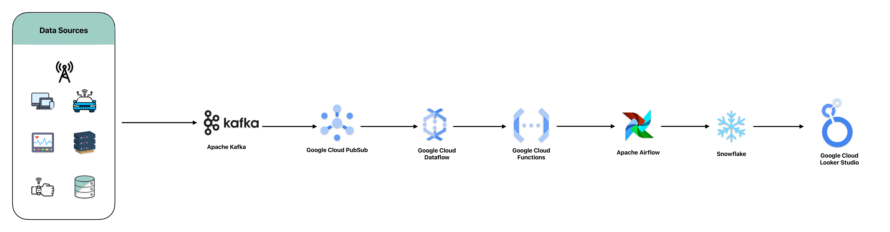

### Real-Time Data Processing and Analytics Solution on GCP, Kafka, Airflow, and Snowflake

In today’s fast-paced digital economy, organizations must process and analyze data in real-time to make timely, data-driven decisions. Real-time data processing is essential for applications like fraud detection, recommendation engines, and operational monitoring, as it allows businesses to react swiftly and adapt to evolving conditions. Without the ability to handle real-time data streams, companies risk financial losses, customer dissatisfaction, and missed opportunities.

---

### Sample Scenario - MadHatter Corp.

MadHatter Corp., a leading e-commerce platform, faced significant challenges in processing and analyzing the vast amounts of data generated by its users in real-time. The company needed to make quick, informed decisions to enhance customer experiences and operational efficiency. However, the existing system, which processed data in batches, introduced delays that negatively impacted critical use cases like fraud detection and personalized recommendation engines. These delays led to financial losses and a suboptimal user experience.

For instance, MadHatter Corp.’s fraud detection system, which relied on delayed data processing, failed to catch fraudulent transactions in time, resulting in significant financial losses. Similarly, their recommendation engine struggled to deliver real-time, personalized product suggestions, leading to reduced user engagement and missed revenue opportunities.

---

### Solution Overview

To address these challenges and enable real-time data processing and analytics, MadHatter Corp. developed an advanced solution built on **Google Cloud Platform (GCP)** services, **Apache Kafka**, **Apache Airflow**, and **Snowflake**. This architecture empowered MadHatter Corp. to capture, process, and analyze real-time data, improving decision-making speed and accuracy across various departments. The new system supports key business functions, including fraud detection, real-time recommendation engines, and dynamic operational monitoring.

---

### GCP, Kafka, Airflow, and Snowflake Architecture

#### 1. **Apache Kafka**
Apache Kafka is a distributed streaming platform used to handle the ingestion of large-scale, real-time data. Kafka's role in the architecture is crucial, as it captures and streams data generated by users on MadHatter Corp.’s platform in real-time. The data includes user activity logs, transaction data, and other operational events. Kafka ensures low-latency data ingestion and acts as the backbone for real-time event streaming.

**Key Features of Apache Kafka:**
- **Low Latency:** Enables real-time data streaming with minimal delays.
- **Scalability:** Handles massive amounts of data from multiple sources.
- **Fault-Tolerant:** Ensures data reliability even in the face of hardware failures.

**Use in Project:**
Kafka is deployed at MadHatter Corp. to capture user behavior data (e.g., clicks, transactions, searches), system logs, and IoT telemetry from various sources. This ensures that critical data streams are processed in near real-time and made available for further analysis and enrichment.

#### 2. **Google Cloud Dataflow**
Google Cloud Dataflow, a fully managed streaming analytics service, processes data in real-time as it is ingested by Kafka. It allows MadHatter Corp. to perform transformations, enrichments, and aggregations on the fly. The seamless integration between Kafka and Dataflow ensures that data is processed in real-time with scalability and fault tolerance.

**Key Features of Google Cloud Dataflow:**
- **Stream Processing:** Supports real-time data processing pipelines with built-in scalability.
- **Auto-Scaling:** Dynamically scales to handle fluctuations in data volumes.
- **Managed Service:** Eliminates the need for infrastructure management, allowing the team to focus on data processing logic.

**Use in Project:**
Google Cloud Dataflow processes the streaming data captured by Kafka in real-time. This includes cleaning, filtering, transforming, and enriching the data to generate insights. For example, transaction data is enriched with additional contextual information to improve fraud detection accuracy.

#### 3. **Apache Airflow**
Apache Airflow is used to orchestrate the real-time workflows of the entire data pipeline. As a task scheduler and automation tool, Airflow manages the dependencies between data ingestion, processing, and storage stages. It ensures that each component of the architecture operates in harmony and triggers appropriate workflows based on the arrival of new data.

**Key Features of Apache Airflow:**
- **Workflow Automation:** Schedules and automates tasks within data pipelines.
- **Scalability:** Manages workflows for large-scale real-time data processing.
- **Extensibility:** Easily integrates with Kafka, Dataflow, Snowflake, and other services.

**Use in Project:**
Airflow schedules and orchestrates the workflows across Kafka, Dataflow, and Snowflake. It ensures that data processing and analytics tasks are executed in the correct order. For example, it automates the process of detecting fraud by triggering downstream tasks as soon as suspicious activity is detected.

#### 4. **Snowflake**
Snowflake, a cloud-based data warehousing and analytics service, plays a critical role in real-time analytics. Snowflake allows MadHatter Corp. to store, query, and analyze large-scale datasets in real-time, ensuring the data is accessible to decision-makers instantly. The real-time capabilities of Snowflake enable fast and complex queries on streaming data, providing immediate insights that drive business decisions.

**Key Features of Snowflake:**
- **Separation of Storage and Compute:** Allows for independent scaling of both, ensuring optimal performance.
- **Real-Time Data Warehousing:** Supports real-time ingestion and querying of data.
- **Concurrency:** Provides high concurrency, enabling multiple stakeholders to query the data simultaneously without performance degradation.

**Use in Project:**
Snowflake is used to store and analyze real-time streaming data ingested from Kafka and processed by Dataflow. Data related to user interactions, transactions, and fraud alerts are stored in Snowflake for further analysis. Business analysts can query this data in real-time to generate reports, visualize trends, and make data-driven decisions.

#### 5. **Google Cloud Pub/Sub and Cloud Functions**
Google Cloud Pub/Sub and Cloud Functions provide real-time event streaming and serverless processing for MadHatter Corp.’s critical use cases like fraud detection. Pub/Sub captures events from various services, and Cloud Functions execute lightweight serverless functions in response to these events.

**Key Features of Google Cloud Pub/Sub:**
- **Event-Driven Architecture:** Supports real-time messaging and event handling.
- **Scalable and Reliable:** Scales to handle millions of events per second.
- **Real-Time Event Streaming:** Delivers events to various systems with low latency.

**Use in Project:**
Google Cloud Pub/Sub captures critical events such as potential fraud attempts and immediately triggers Cloud Functions to process the events and send real-time alerts. This ensures that the security team can respond to threats as they occur.

#### 6. **Looker Studio (formerly Google Data Studio)**
Looker Studio is used to create real-time data visualizations and dynamic dashboards for decision-makers at MadHatter Corp. The dashboards update in real-time as new data flows through the system, providing the team with up-to-the-minute insights on user behavior, transaction patterns, and system performance.

**Key Features of Looker Studio:**
- **Real-Time Dashboards:** Provides live data visualization, enabling timely decision-making.
- **Customization:** Allows for the creation of interactive, custom dashboards.
- **Integration:** Seamlessly integrates with Snowflake, Kafka, and other GCP services for real-time reporting.

**Use in Project:**
Looker Studio is used to build dynamic dashboards that display real-time analytics for MadHatter Corp.’s key metrics, such as fraud detection rates, sales performance, and operational efficiency. Business users can interact with these dashboards to gain insights and adjust strategies accordingly.

---

### Business Outcomes

By implementing this real-time data processing and analytics architecture, MadHatter Corp. transformed its operations and enhanced its competitive edge. Key benefits included:

- **Real-Time Fraud Detection:** The new system significantly reduced financial losses by identifying and alerting suspicious activity as it occurred, allowing immediate intervention.
- **Personalized Recommendations:** The recommendation engine now provides real-time, personalized product suggestions, driving user engagement and boosting sales.
- **Operational Efficiency:** Dynamic dashboards powered by Looker Studio enabled proactive monitoring and faster decision-making, resulting in improved system performance and customer satisfaction.

This solution positioned MadHatter Corp. as a leader in the e-commerce space by ensuring timely, data-driven decision-making and optimized customer experiences.

---

### References:
- [Google Cloud IAM Documentation](https://cloud.google.com/iam/docs)
- [Google Cloud KMS Documentation](https://cloud.google.com/kms/docs)
- [Apache Kafka Documentation](https://kafka.apache.org/documentation/)
- [Google Cloud Security Command Center (SCC) Documentation](https://cloud.google.com/security-command-center/docs)
- [Apache Airflow Documentation](https://airflow.apache.org/docs/)
- [Snowflake Documentation](https://docs.snowflake.com/en/)
- [Google Cloud Audit Logs Documentation](https://cloud.google.com/logging/docs/audit)