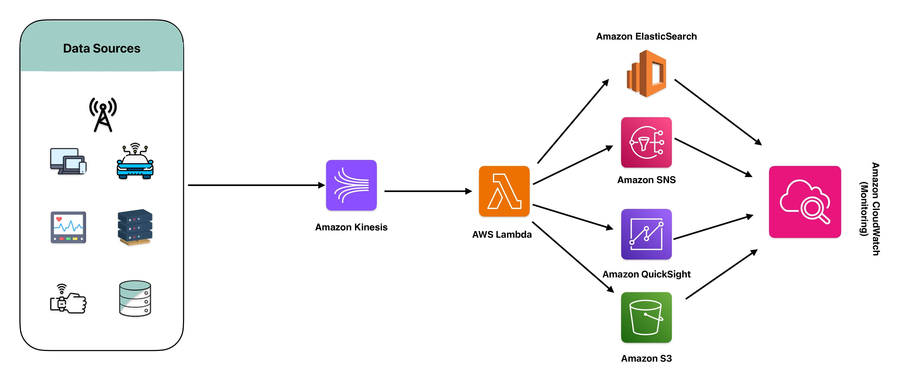

# Real-Time Data Processing and Analytics Solution
In today’s fast-paced world, organizations need to process and analyze data in real-time to stay competitive. Real-time data processing enables businesses to make quick, informed decisions based on the latest information. This capability is essential for applications such as fraud detection, recommendation engines, and operational monitoring.

## Sample Scenario - MadHatter Corp.
To enable real-time data processing and analytics, we implemented a solution using Amazon Kinesis for capturing and streaming real-time data, AWS Lambda for processing data in real-time, Amazon Elasticsearch Service for indexing and searching data, Amazon SNS for real-time notifications, and Amazon QuickSight for real-time data visualization. This architecture allows us to capture, process, and analyze data as it arrives, providing immediate insights and enabling timely decision-making.

## AWS Tools Used - DeepDive

## Usage

### Requirements

### Steps

## References
